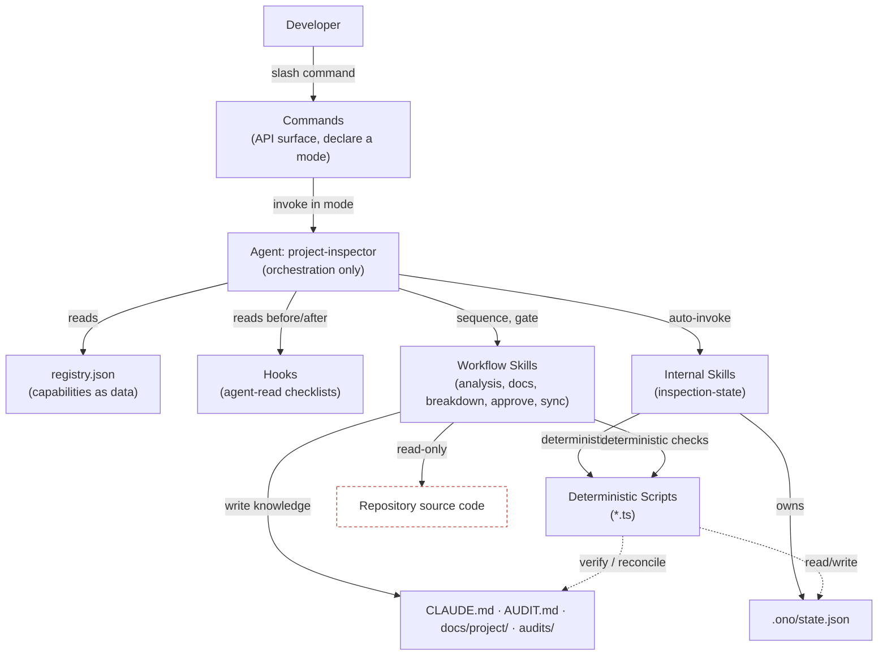
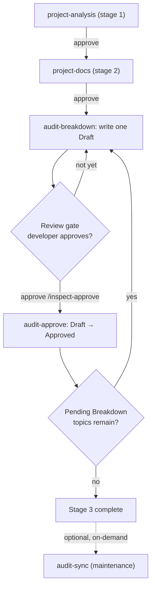
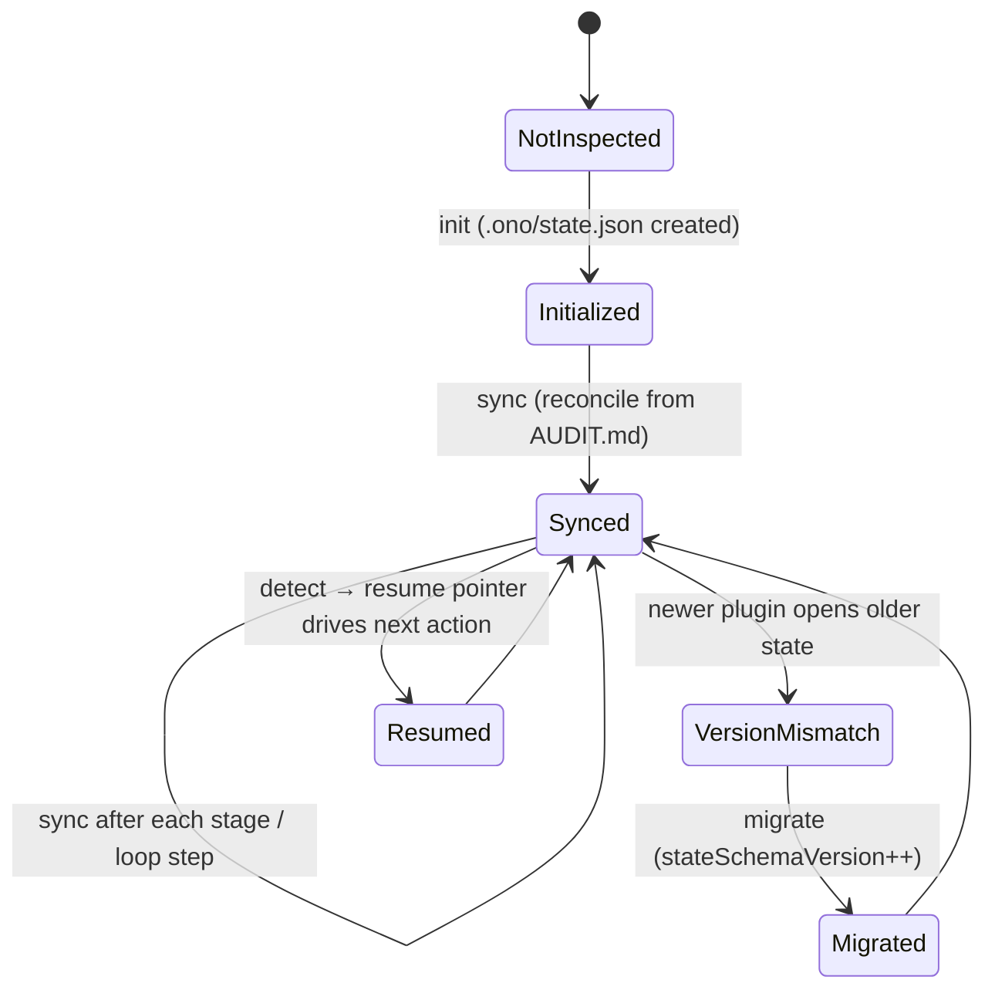
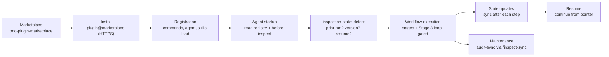
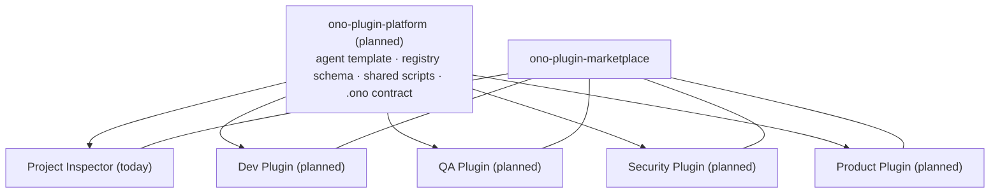

# Ono Plugin Platform — Architecture

**Status:** Living document · Reference implementation: **Ono Project Inspector** (`ono-project-inspector`)
**Scope:** Platform architecture (not a single plugin). Project Inspector is used throughout as the concrete, shipping example of the platform.
**Intended home:** This document currently lives inside the Project Inspector repository. It is written as platform documentation and is expected to migrate to a dedicated `ono-plugin-platform` repository once the platform matures.

> **Reading note.** Everything described as *existing* is implemented today in the reference plugin and can be traced to a file in this repository. Anything not yet built is explicitly marked **(planned)**. The platform deliberately has no runtime of its own beyond Claude Code: it is a set of conventions, a registry contract, and a small deterministic tool layer that any Ono plugin follows.

---

## 1. Vision

### What is the Ono Plugin Platform?

The Ono Plugin Platform is a **convention-driven architecture for building Claude Code plugins** that perform structured, multi-stage work over a local repository — safely, repeatably, and with a human in the loop at every consequential step.

It is not a framework you import. It is a **shared shape**: a way of wiring Claude Code's native primitives (commands, agents, skills, hooks, marketplaces) plus a thin deterministic script layer and a persistent state file, so that every Ono plugin behaves consistently and predictably.

A platform plugin is characterized by:

- **A single orchestrating agent** that owns all sequencing and never does domain work itself.
- **A registry** (`skills/registry.json`) that declares what the plugin can do, as data.
- **Skills** that own all business logic and are the only components allowed to write to the repository.
- **Approval gates** so nothing irreversible happens without an explicit human decision.
- **Persistent, portable state** so any run is resumable and version-aware.
- **A read-only stance toward source code** — the platform builds *knowledge about* a repository; it does not modify the repository's source.

### Why it exists

Ad-hoc "prompt a big agent to do everything" automation is hard to trust, hard to resume, and impossible to extend without rewriting. The platform exists to make repository-scale AI work:

- **Auditable** — each stage produces a reviewable artifact and stops for approval.
- **Repeatable** — the same registry-driven flow runs the same way every time.
- **Resumable** — an interrupted run continues exactly where it left off.
- **Extensible** — adding capability is mostly a data change (a registry entry + a skill folder), not a rewrite of the orchestrator.
- **Safe** — a strict separation between "read and reason" and "write" keeps source code untouched and confines writes to well-defined artifacts.

### Long-term goals

- A **family of plugins** (Project Inspector today; Dev, QA, Security, Product **(planned)**) that all share one orchestration engine and one set of guarantees.
- A **stable registry + state contract** that new plugins target without reinventing orchestration.
- A dedicated **`ono-plugin-platform` repository (planned)** that houses these conventions, shared scripts, and this document, with individual plugins depending on it.

---

## 2. Core Architecture

The platform is a strict, layered pipeline. Control flows downward; each layer has exactly one kind of responsibility and never reaches around its neighbors.

```
Developer
   ↓        types a slash command
Commands    thin API surface (mode declarations)
   ↓        invoke the one agent in a declared mode
Agent       orchestration only — reads the registry, sequences skills, enforces gates
   ↓        auto-invokes infrastructure
Internal Skills   persistent state, versioning, resume (via deterministic scripts)
   ↓        sequences domain work
Workflow Skills   business logic — the only writers of repository artifacts
   ↓        read source (read-only), write knowledge artifacts
Repository  source code (never modified) + generated knowledge + .ono/ state
```



The single most important structural rule: **the agent orchestrates but never writes; skills write but never orchestrate.** Everything else follows from that split.

---

## 3. Core Components

Each component below maps to real files in the reference plugin.

### Commands
**Files:** `commands/*.md` — `inspect`, `inspect-status`, `inspect-topic`, `inspect-approve`, `inspect-sync`.

Commands are the **public API** of a plugin and nothing more. A command file is a thin wrapper that declares an agent **mode** and passes through arguments (e.g. a repository path or a topic name). It contains no orchestration logic, no repository analysis, and no skill knowledge beyond which mode to request.

| Command | Mode | Purpose |
|---|---|---|
| `/inspect [repo]` | `full` | Run the guided end-to-end workflow. |
| `/inspect-status [repo]` | `status` | Read-only progress snapshot; writes nothing. |
| `/inspect-topic [topic] [repo]` | `targeted` | Run one breakdown cycle for a specific/next topic. |
| `/inspect-approve [repo]` | `resume` | Approve the current gate (finalize a Draft, or advance a stage). |
| `/inspect-sync [repo]` | `maintenance` | Run the on-demand maintenance tool. |

### Agent
**File:** `agents/project-inspector.md` (`tools: Read, Skill`).

The agent is the **sole orchestrator**. It reads the registry, sequences skills in stage order, consults hook checklists, enforces approval gates, computes/uses resume state, and reports progress. It has five modes (`full`, `status`, `targeted`, `resume`, `maintenance`), each entered by a command.

Hard boundaries (enforced in the agent's own instructions):
- It **never reads or writes** `CLAUDE.md`, `AUDIT.md`, `audits/*`, or source — that is delegated to skills.
- It **never hardcodes** skill names, counts, or order beyond what the registry declares.
- It **never advances past an approval gate** without explicit developer confirmation.
- It only holds `Read` and `Skill` tools — it structurally *cannot* edit files.

### Registry
**File:** `skills/registry.json`.

The registry is the **capability contract**: a data description of every skill, how skills relate, and how they wire to hooks. Adding a skill that fits an existing shape is a registry edit plus a skill folder — no agent change. Each entry declares:

| Field | Meaning |
|---|---|
| `id`, `enabled`, `path` | Identity, on/off, location. |
| `type` | `workflow` (agent-sequenced) or `internal` (auto-invoked infrastructure). |
| `autoInvoke` | For `internal` skills: the agent calls them automatically at checkpoints. |
| `stage` | Ordering within the linear inspection sequence. |
| `role`, `pairsWith` | Intra-stage relationships (e.g. the breakdown↔approve pair). |
| `workflowRole` | `inspection` (in the linear loop) or `maintenance` (on-demand only). |
| `requires`, `produces` | Prerequisite artifacts and output artifacts. |
| `completion` | How a stage's completion is detected: `artifacts` (all `produces` exist on disk — the default) or `topics` (every `AUDIT.md` topic Approved). Read by the state helper; no stage list is hardcoded. |
| `repeatable`, `requiresApproval` | Loop semantics and gating. |
| `hooks` | `{ before, after }` checkpoint files. |

### Internal Skills
**File:** `skills/inspection-state/SKILL.md` (`type: internal`, `autoInvoke: true`).

Internal skills own **infrastructure**, not domain output. They are not user-facing (no command), never appear as a workflow stage, have no approval gate, and are invoked automatically by the agent at defined checkpoints. In the reference plugin the only internal skill is `inspection-state`, which owns the orchestration state file (see §5).

### Workflow Skills
**Files:** `skills/project-analysis`, `skills/project-docs`, `skills/audit-breakdown`, `skills/audit-approve`, `skills/audit-sync`.

Workflow skills own **all business logic** and are the **only components permitted to write repository artifacts** (each within its own output contract). They ask their own intake questions, do read-only source inspection, and produce or update exactly the artifacts they declare.

| Skill | Stage / role | Writes | Never |
|---|---|---|---|
| `project-analysis` | 1 · analysis | `CLAUDE.md`, `AUDIT.md` | no `audits/` |
| `project-docs` | 2 · docs | `docs/project/*.md` | no `CLAUDE.md`/`AUDIT.md` |
| `audit-breakdown` | 3 · breakdown | one `audits/<slug>/<slug>-audit.md` (Draft) | never marks Approved |
| `audit-approve` | 3 · approval | flips one `AUDIT.md` row → Approved | never drafts / never touches `CLAUDE.md` |
| `audit-sync` | maintenance | `CLAUDE.md` managed blocks only | never marks Approved / `AUDIT.md` read-only |

### Hooks
**Files:** `hooks/*.md` — `before-inspect`, `after-project-analysis`, `after-project-docs`, `after-audit-breakdown`, `after-audit-approve`, `after-audit-sync`.

Hooks are **agent-read markdown checklists**, consulted before/after a stage. **They are deliberately *not* Claude Code `hooks.json` / `PreToolUse` / `PostToolUse` events.** This keeps the extensibility model uniform — everything the agent consults (skills, hooks, registry) is text it reads and follows — and avoids shell-level hook plumbing for what is fundamentally an LLM-driven review-and-approve flow. A hook is the enforcement point where the agent verifies a skill's output contract (often by running a deterministic script) and decides whether to proceed, loop, or stop.

### Deterministic Scripts
**Files:** `scripts/slugify.ts`, `scripts/update-audit-index.ts`, `scripts/inspection-state.ts`.

Skills produce prose by LLM judgment, which is unreliable for exact-match bookkeeping (slugs, table cells, JSON state). Deterministic scripts own that **structured data**:

- `slugify.ts` — the single source of truth for topic → slug.
- `update-audit-index.ts` — verifies the `AUDIT.md` row for a topic (status, and that the `File` reference matches the deterministic slug on `Draft`/`Approved` rows). **Verification-only** — it never rewrites the file; discrepancies are reported, not patched.
- `inspection-state.ts` — reads/writes/reconciles/migrates `.ono/state.json` (see §5).

Scripts are invoked from hooks and from the internal skill. They never make judgment calls or write prose artifacts.

### Repository Knowledge
The generated artifacts, all in the **target** repository:

- `CLAUDE.md` — compact project context for every future Claude Code session (contains `audit-sync` managed-block markers).
- `AUDIT.md` — concise audit **topic index**; the **human source of truth** for topic status.
- `docs/project/*.md` — descriptive knowledge base (overview, components, patterns, integrations).
- `audits/<slug>/<slug>-audit.md` — one evaluative audit document per topic.
- `.ono/state.json` — orchestration state (see §5). `.ono/` is the shared Ono infrastructure directory.

**Source code is never modified** by any component.

### Marketplace
**Repo:** `ono-plugin-marketplace` (`.claude-plugin/marketplace.json`).

The marketplace is the **distribution surface**. It lists plugins and points each at its source. The reference plugin is referenced with an explicit **HTTPS `url` source**, so installation works for any developer without SSH keys configured:

```json
{
  "name": "ono-project-inspector",
  "source": { "source": "url", "url": "https://github.com/appsadmin-design/ono-plugin-project-inspector.git", "ref": "main" }
}
```

---

## 4. Workflow Engine

The "engine" is the agent's generic loop over the registry — there is no separate runtime.

### Stage execution
The agent considers only enabled entries with `type: workflow` and `workflowRole: inspection`, in ascending `stage` order. `type: internal` skills are excluded (auto-invoked instead); `workflowRole: maintenance` skills are excluded (on-demand only). For each stage it runs: **prerequisite check → before-hook → invoke skill → after-hook → update state → approval gate**.

### The breakdown-approve loop (paired stages)
Stage 3 is not linear; it is a loop expressed via `role`/`pairsWith`. `audit-breakdown` (`requiresApproval: true`) writes one Draft and stops at a review gate. On approval, `audit-approve` (`requiresApproval: false` — running it *is* the approval) finalizes that topic, and the agent immediately breaks down the next topic. Two Drafts are never generated without a review gate between them.



### Approval gates
Every inspection stage stops for a human decision. Gating is declarative (`requiresApproval`) and enforced by the agent, independent of whatever a skill says internally. This is the platform's core safety property.

### Resume
On startup the agent does not re-guess progress from files; it reads the **resume pointer** from `inspection-state` and continues exactly there (a Draft awaiting review, the next topic to break down, or "complete"). See §5.

### State management
After every stage and every loop step, the agent invokes `inspection-state` (`sync`) to record completion, reconcile the topic snapshot, and refresh the resume pointer. State is a mirror of `AUDIT.md` plus orchestration-only data (see §5).

### Versioning
State records the writing **plugin version** (`plugin.version`, from `plugin.json`) and an independent **`stateSchemaVersion`**. On startup, a mismatch between the stored plugin version and the current one is surfaced to the developer before proceeding.

### Migrations
`stateSchemaVersion` makes the state file forward-migratable. The helper's `migrate` step advances an older file to the current schema and records each step in `migrations.history`. Migrations are a **first-class** concern, present from v1 even though only one schema exists today.

---

## 5. State Management

### `.ono/state.json`
A single JSON file in the target repo, owned exclusively by the internal `inspection-state` skill via `scripts/inspection-state.ts`. `.ono/` is intended as the shared infrastructure directory for all Ono plugins; this plugin owns only `state.json` within it.

### Why it exists
Before it, "resume" was reconstructed by guessing from artifacts on disk, and there was no record of *what* was done, in *which* version, or *where* an interrupted run stopped. The state file gives the workflow a durable, portable, versioned memory: detect prior inspection, resume precisely, detect version mismatch, and migrate forward.

### What it stores (schema v1)
```jsonc
{
  "stateSchemaVersion": 1,
  "plugin": { "name": "ono-project-inspector", "version": "0.6.0" },
  "repository": { "gitRemote": "https://…/repo.git or null", "gitHead": "sha or null" },
  "createdAt": "…", "updatedAt": "…",
  "inspection": { "started": true, "completedStages": ["project-analysis"], "currentStage": "project-docs", "stage3Complete": false },
  "stages":  { "project-analysis": { "status": "complete", "completedAt": "…" }, "…": {} },
  "topics":  [ { "index": "1", "topic": "…", "slug": "…", "status": "Draft|Approved|Pending Breakdown", "file": "audits/…", "draftedAt": "…", "approvedAt": null } ],
  "counts":  { "pendingBreakdown": 0, "draft": 0, "approved": 1, "total": 1 },
  "resume":  { "nextAction": "review-draft|breakdown-next|run-stage|stage3-complete|idle", "topic": "… or null", "hint": "human-readable next step" },
  "maintenance": { "lastSyncAt": "… or null" },
  "migrations": { "history": [] }
}
```

**Portability rule:** the file stores only **repo-relative paths** and the git remote — **never absolute filesystem paths** — so it is committed to Git and travels across machines and clones.

### Why `AUDIT.md` remains the human source of truth
`AUDIT.md` is what a person reads and reasons about: the topic index, statuses, and links. It is authored and reviewed by humans and skills as prose. State must never override it. On every `sync`, `inspection-state` **re-derives** its topic snapshot *from* `AUDIT.md`.

### Why `state.json` is the orchestration source of truth
The agent needs fast, exact, machine-readable answers to "what's done, what's next, which version" that prose cannot reliably provide. For *orchestration decisions* — resume, completion, version/migration — `state.json` is authoritative. The two never conflict because state is a projection of `AUDIT.md` plus orchestration-only fields (versions, stage completion, timestamps, resume pointer).

**Fully registry-driven.** The state helper (`scripts/inspection-state.ts`) contains no hardcoded stage list. It reads the ordered `type: workflow` + `workflowRole: inspection` entries from `registry.json` and derives per-stage completion, `completedStages`, `currentStage`, and the `resume` pointer from each stage's `stage`, `produces`, and `completion` fields. Adding a new linear stage is therefore a registry entry plus a `skills/<id>/SKILL.md` folder — the agent executes it and the state helper tracks and resumes it with no code change. The derivation is deterministic (plain artifact-existence and topic-count checks); no orchestration logic lives in the LLM.



---

## 6. Design Principles

1. **Single Responsibility.** Every component does one thing. `audit-breakdown` drafts; `audit-approve` finalizes; `audit-sync` maintains docs. Splitting approval into its own skill was a deliberate application of this principle.
2. **Commands are API only.** Command files declare a mode and pass arguments — no logic. The API surface is stable even as internals change.
3. **The agent owns orchestration.** All sequencing, gating, and resume live in one agent. It holds only `Read`/`Skill` and cannot itself write.
4. **Skills own business logic.** Domain reasoning and *all* repository writes live in skills, each within a declared output contract.
5. **Internal skills own infrastructure.** Cross-cutting plumbing (state) is a `type: internal`, auto-invoked skill — never a user-facing stage.
6. **Deterministic scripts own structured data.** Slugs, table bookkeeping, and JSON state are handled by `*.ts` helpers, not LLM judgment. Scripts verify; they do not silently patch.
7. **Documentation is human-readable.** `CLAUDE.md`, `AUDIT.md`, `docs/project/`, and `audits/` are for people first. Machine state lives separately in `.ono/`.
8. **State is persistent.** Progress is written to `.ono/state.json`, committed to Git, and portable across machines.
9. **Everything should be resumable.** Any run can be interrupted and continued precisely, driven by the state resume pointer rather than by re-guessing.
10. **Versioning and migrations are first-class.** Plugin version and `stateSchemaVersion` are recorded; mismatches are surfaced and migrations are supported from day one.

Two cross-cutting invariants underpin all ten: **read-only toward source code**, and **human approval before anything consequential**.

---

## 7. Plugin Lifecycle



1. **Marketplace** — the plugin is listed with an HTTPS source and a version.
2. **Installation** — `claude plugin install …` clones over HTTPS; `plugin.json` is the version authority.
3. **Registration** — Claude Code loads the plugin's commands, agent, and skills from `plugin.json`.
4. **Agent startup** — on a command, the agent reads `registry.json` and the `before-inspect` hook, then (via `inspection-state`) detects prior inspection, handles version mismatch/migration, and computes the resume pointer.
5. **Workflow execution** — the agent runs stages in order, enforcing approval gates and the Stage 3 loop.
6. **State updates** — after each step, `inspection-state` reconciles `.ono/state.json` from `AUDIT.md` and refreshes the resume pointer.
7. **Resume** — a later `/inspect` or `/inspect-approve` continues exactly where the last run stopped.
8. **Maintenance** — `audit-sync` runs on demand (`/inspect-sync`) to reflect Approved findings into `CLAUDE.md` and check for drift; it is outside the linear workflow.

---

## 8. Future Platform

The engine is domain-agnostic: it sequences registry entries, gates on approval, persists state, and confines writes to skills. New Ono plugins reuse it by shipping their own **registry + skills + hooks + scripts**, changing *what* the skills do, not *how* orchestration works. All of the following are **(planned)**.

- **Dev Plugin (planned)** — detailed-design and task-generation skills (a design skill already exists in this org's toolset as a separate capability); same gated, resumable flow producing design/spec artifacts instead of audits.
- **QA Plugin (planned)** — test-inventory and coverage-gap skills producing QA knowledge artifacts, each stage reviewed and approved.
- **Security Plugin (planned)** — read-only security-surface mapping and finding breakdown, reusing the breakdown → approve loop for security topics.
- **Product Plugin (planned)** — product/requirements knowledge base built from the same analysis → docs → topic-breakdown shape.

Each would:
- Register its skills with `type`/`workflowRole`/`role` so the existing agent sequences them unchanged.
- Reuse `inspection-state` and `.ono/` for resume, versioning, and migrations.
- Reuse the deterministic-script pattern for any structured bookkeeping.
- Publish through the same marketplace.

A shared **`ono-plugin-platform` repository (planned)** would hold the common agent template, registry schema, shared scripts, and this document, with each plugin depending on it rather than copying it.



---

## 9. Mermaid Diagrams

The diagrams above cover: **overall architecture** (§2), **workflow execution incl. the Stage 3 loop** (§4), **state lifecycle** (§5), and **plugin lifecycle** (§7). The internal-interaction sequence for a single approval-and-continue cycle is below.

```mermaid
sequenceDiagram
    actor Dev as Developer
    participant Cmd as /inspect-approve
    participant Agent as project-inspector
    participant Approve as audit-approve (skill)
    participant Break as audit-breakdown (skill)
    participant State as inspection-state (internal)
    participant Script as inspection-state.ts
    participant Repo as Repository

    Dev->>Cmd: approve current Draft
    Cmd->>Agent: resume mode
    Agent->>Approve: invoke (finalize reviewed topic)
    Approve->>Repo: AUDIT.md row Draft → Approved
    Agent->>State: sync
    State->>Script: reconcile from AUDIT.md
    Script->>Repo: write .ono/state.json (resume pointer)
    Agent->>Break: invoke (next Pending Breakdown topic)
    Break->>Repo: write audits/<slug>/<slug>-audit.md (Draft)
    Agent->>State: sync
    State->>Script: reconcile
    Script->>Repo: update .ono/state.json
    Agent-->>Dev: stop at new Draft's review gate
```

---

## 10. Implementation Fidelity

This document describes the architecture **as implemented today** in the Project Inspector reference plugin, and explains the reasoning behind it. Traceability:

| Concept | Where it lives today |
|---|---|
| Commands / modes | `commands/*.md` |
| Agent / orchestration | `agents/project-inspector.md` |
| Registry contract | `skills/registry.json` |
| Internal skill / state | `skills/inspection-state/SKILL.md`, `scripts/inspection-state.ts` |
| Workflow skills | `skills/{project-analysis,project-docs,audit-breakdown,audit-approve,audit-sync}/SKILL.md` |
| Hooks (agent-read) | `hooks/*.md` |
| Deterministic scripts | `scripts/{slugify,update-audit-index,inspection-state}.ts` |
| Knowledge artifacts | target repo: `CLAUDE.md`, `AUDIT.md`, `docs/project/`, `audits/` |
| State | target repo: `.ono/state.json` |
| Distribution | `ono-plugin-marketplace/.claude-plugin/marketplace.json` |

Anything labeled **(planned)** is not yet built. No component is described that does not exist in this repository unless explicitly marked planned. As the platform matures and this document moves to `ono-plugin-platform`, the plugin-specific references above should be generalized into the shared platform contract while keeping Project Inspector as the reference implementation.
